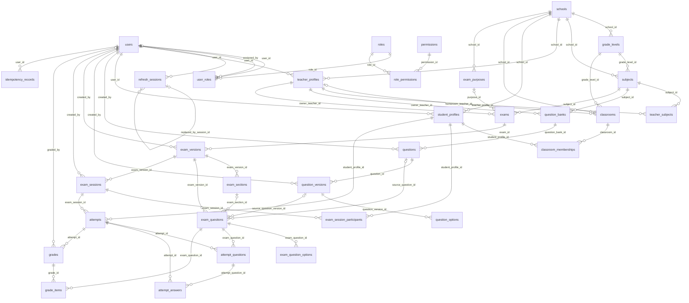

# Quizopia MVP Database — Source of Truth

> Trạng thái: **Approved for MVP Phase 1**  
> DBMS: **PostgreSQL 15+**  
> ORM: **Spring Data JPA / Hibernate**  
> Migration: **Flyway**  
> Phạm vi: **32 bảng cốt lõi**

## 1. Vai trò của tài liệu

Đây là nguồn sự thật chính thức về database của MVP Quizopia. Agent phải đọc tài liệu này
trước khi tạo migration, entity, repository, service hoặc API liên quan.

`DATABASE_ANALYSIS.md` là tài liệu tham chiếu nghiệp vụ của hệ thống cũ. MVP giữ các khái niệm
cốt lõi nhưng điều chỉnh thiết kế cho Spring Boot, PostgreSQL, versioning, autosave,
submit idempotent và authorization nhiều tầng.

## 2. Phạm vi MVP

### Identity
`users`, `roles`, `permissions`, `user_roles`, `role_permissions`, `refresh_sessions`

### Academic
`schools`, `grade_levels`, `subjects`, `teacher_profiles`, `student_profiles`,
`classrooms`, `classroom_memberships`, `teacher_subjects`

### Question Bank
`question_banks`, `questions`, `question_versions`, `question_options`

### Exam
`exam_purposes`, `exams`, `exam_versions`, `exam_sections`, `exam_questions`,
`exam_question_options`, `exam_sessions`, `exam_session_participants`

### Attempt & Grading
`attempts`, `attempt_questions`, `attempt_answers`, `grades`, `grade_items`,
`idempotency_records`

## 3. Ngoài phạm vi hiện tại

Không tự ý thêm OAuth account, password reset, MFA, academic-year table, semester,
course offering, Excel import job, homework, document/resource, audit, notification,
outbox, incident hoặc review request trước khi có quyết định mới.

## 4. Quy ước database

- Tên bảng/cột dùng `snake_case`.
- PK dùng `BIGINT GENERATED BY DEFAULT AS IDENTITY`.
- Thời gian dùng `TIMESTAMPTZ`.
- Điểm dùng `NUMERIC(10,2)`.
- Enum nghiệp vụ dùng `VARCHAR` + `CHECK`.
- JSONB chỉ dùng cho answer payload, metadata và order có cấu trúc biến đổi.
- JPA phải dùng `ddl-auto=validate`, không dùng `update`.
- Schema chỉ thay đổi bằng Flyway.
- Không sửa migration đã áp dụng; luôn tạo migration mới.
- `updated_at` do application/JPA cập nhật, không dùng trigger trong MVP.
- Entity có cột `version` phải ánh xạ bằng `@Version`.
- Không trả JPA entity trực tiếp từ controller.

## 5. Quy tắc bảo mật

- `password_hash` là Argon2id hash.
- Refresh token gửi bằng HttpOnly cookie; database chỉ lưu `token_hash`.
- Không lưu access token trong database hoặc localStorage.
- Phone dùng AES-256-GCM: ciphertext + IV + key version; khóa ở ngoài DB.
- Không log password, raw token hoặc dữ liệu nhạy cảm.
- Authorization = role/permission + ownership/assignment + school scope + state/time.
- Backend deny by default.

## 6. Deletion policy

- Mặc định `ON DELETE RESTRICT`.
- `CASCADE` chỉ áp dụng cho bảng nối, refresh session hoặc child không có vòng đời độc lập.
- `SET NULL` dùng khi cần giữ lịch sử nhưng actor/owner có thể bị vô hiệu hóa.
- Không hard-delete exam version, snapshot, attempt, answer, grade hoặc grade item sau khi thi.
- Soft delete không thay cho audit và retention.

## 7. Invariant bắt buộc

### Identity
1. Một username chỉ thuộc một user.
2. Một user có thể có nhiều role.
3. Refresh phải rotate token và revoke token cũ.
4. Phát hiện reuse phải revoke toàn bộ token family.

### Academic
1. Grade level, subject, profile và classroom phải cùng school theo application rule.
2. Một student chỉ xuất hiện một lần trong cùng classroom.
3. MVP yêu cầu teacher/student đều có account `users`.
4. `academic_year` có định dạng `YYYY-YYYY`; service kiểm tra năm sau = năm trước + 1.

### Question Bank
1. `questions` là định danh; nội dung nằm trong `question_versions`.
2. `current_version_number` phải trỏ đến version tồn tại.
3. Version đã dùng để publish đề không được sửa.
4. SINGLE_CHOICE có đúng một đáp án đúng.
5. MULTIPLE_CHOICE có ít nhất một đáp án đúng.
6. ESSAY không tạo `question_options`.

### Exam
1. `exams` là định danh; nội dung nằm trong `exam_versions`.
2. Exam version `PUBLISHED` là bất biến.
3. Publish phải copy snapshot vào `exam_questions` và `exam_question_options`.
4. Học sinh làm bài từ snapshot, không đọc trực tiếp Question Bank.
5. Session chỉ dùng một exam version đã publish.
6. Gán cả lớp bằng cách mở rộng membership thành participant rows.
7. Không vượt `max_attempts`.

### Attempt & Grading
1. Start attempt và tạo `attempt_questions` trong cùng transaction.
2. Random order ổn định trong toàn bộ attempt.
3. Autosave chỉ nhận `sequence_number` mới hơn.
4. Submit chính thức là transaction PostgreSQL, có idempotency key.
5. Không dùng Redis queue hoặc `@Async` để ghi submit chính thức.
6. Notification/WebSocket chỉ phát sau commit.
7. Mỗi attempt có tối đa một grade.
8. Grade item lưu điểm theo từng snapshot question.

## 8. Luồng cốt lõi

```text
Question Bank
→ Question
→ Question Version
→ Exam
→ Exam Version DRAFT
→ Snapshot Exam Questions/Options
→ Exam Version PUBLISHED
→ Exam Session
→ Participants
→ Attempt + Stable Question Order
→ Autosave Answers
→ Idempotent Submit
→ Grade + Grade Items
```

## 9. ERD tổng quát



## 10. Danh sách bảng

| Bảng | Module | Trách nhiệm |
|---|---|---|
| `users` | Identity & Authorization | Tài khoản và danh tính đăng nhập. |
| `roles` | Identity & Authorization | Danh mục vai trò hệ thống. |
| `permissions` | Identity & Authorization | Danh mục mã quyền ổn định. |
| `user_roles` | Identity & Authorization | Gán nhiều vai trò cho một user. |
| `role_permissions` | Identity & Authorization | Gán quyền vào vai trò. |
| `refresh_sessions` | Identity & Authorization | Refresh token opaque, rotation và reuse detection. |
| `schools` | Academic | Trường học. |
| `grade_levels` | Academic | Khối lớp 10/11/12. |
| `subjects` | Academic | Môn học theo trường và khối lớp, bám sát nghiệp vụ tham chiếu. |
| `teacher_profiles` | Academic | Hồ sơ giáo viên, composition với users. |
| `student_profiles` | Academic | Hồ sơ nghiệp vụ học sinh; MVP yêu cầu có tài khoản users. |
| `classrooms` | Academic | Lớp học cụ thể; MVP lưu trực tiếp school, grade, academic_year và homeroom teacher. |
| `classroom_memberships` | Academic | Học sinh trong lớp, thay student_class. |
| `teacher_subjects` | Academic | Giáo viên dạy nhiều môn. |
| `question_banks` | Question Bank | Ngân hàng câu hỏi thuộc một môn và do giáo viên sở hữu. |
| `questions` | Question Bank | Danh tính ổn định của câu hỏi. |
| `question_versions` | Question Bank | Phiên bản nội dung câu hỏi. |
| `question_options` | Question Bank | Lựa chọn của câu hỏi. |
| `exam_purposes` | Exam | Mục đích kỳ thi. |
| `exams` | Exam | Danh tính đề thi; nội dung nằm trong exam_versions. |
| `exam_versions` | Exam | Phiên bản/snapshot đề. |
| `exam_sections` | Exam | Phần câu hỏi. |
| `exam_questions` | Exam | Snapshot câu hỏi trong đề. |
| `exam_question_options` | Exam | Snapshot lựa chọn trong đề. |
| `exam_sessions` | Exam | Ca thi tách khỏi nội dung đề. |
| `exam_session_participants` | Exam | Danh sách học sinh được phép dự ca thi; lớp được mở rộng thành participant rows. |
| `attempts` | Attempt & Grading | Một lượt làm bài. |
| `attempt_questions` | Attempt & Grading | Thứ tự câu và lựa chọn ổn định. |
| `attempt_answers` | Attempt & Grading | Autosave câu trả lời từng câu. |
| `grades` | Attempt & Grading | Kết quả chấm chính thức. |
| `grade_items` | Attempt & Grading | Điểm theo câu hỏi. |
| `idempotency_records` | Attempt & Grading | Lưu kết quả command để retry an toàn. |

## 11. Quy tắc cho agent

Agent phải:

1. Liệt kê files, data flow, authorization, transaction và edge cases trước khi code.
2. Không đổi tên bảng/cột mà chưa cập nhật tài liệu.
3. Không thêm bảng “để dành cho tương lai”.
4. Không dùng JPA inheritance cho teacher/student.
5. Không dùng entity làm request/response DTO.
6. Không dùng `CascadeType.ALL` hoặc collection EAGER mặc định.
7. Module khác không truy cập trực tiếp repository nội bộ.
8. Viết integration test với PostgreSQL Testcontainers.
9. Test unique, FK, state, ownership, 401 và 403.
10. Không sửa migration cũ.

## 12. Flyway plan

Nếu đã có `V1__initialize_database.sql`, giữ nguyên và tạo:

```text
V2__create_identity_schema.sql
V3__seed_roles_and_permissions.sql
V4__create_academic_schema.sql
V5__create_question_bank_schema.sql
V6__create_exam_schema.sql
V7__create_attempt_and_grading_schema.sql
```

Số version thực tế phải tiếp nối migration đang có trong repository.

## 13. Acceptance criteria

- 32 bảng khớp tài liệu.
- Migration chạy trên PostgreSQL sạch.
- `ddl-auto=validate` pass.
- Role/permission seed không tạo duplicate.
- Sửa Question Bank không đổi đề đã publish.
- Autosave cũ không ghi đè autosave mới.
- Retry submit cùng key không tạo grade lặp.
- Xóa mềm account không làm mất lịch sử thi.


# Data Dictionary — Identity

# Data Dictionary — Academic

## `schools`

Trường học.

| Cột | Kiểu | Null | Ràng buộc / ý nghĩa |
|---|---|:---:|---|
| `id` | `BIGINT` | Không | PK; identity |
| `code` | `VARCHAR(50)` | Không | UQ/part of UQ |
| `name` | `VARCHAR(255)` | Không |  |
| `address` | `VARCHAR(500)` | Có |  |
| `timezone` | `VARCHAR(80)` | Không | default `'Asia/Ho_Chi_Minh'` |
| `status` | `VARCHAR(30)` | Không | default `'ACTIVE'` |

## `grade_levels`

Khối lớp 10/11/12.

| Cột | Kiểu | Null | Ràng buộc / ý nghĩa |
|---|---|:---:|---|
| `id` | `BIGINT` | Không | PK; identity |
| `school_id` | `BIGINT` | Không | UQ/part of UQ; FK → `schools.id`; DELETE RESTRICT |
| `code` | `VARCHAR(30)` | Không | UQ/part of UQ |
| `name` | `VARCHAR(100)` | Không |  |
| `sort_order` | `INTEGER` | Không | default `0` |

**Unique constraints**
- `uk_grade_level_school_code`: (school_id, code)

## `subjects`

Môn học theo trường và khối lớp, bám sát nghiệp vụ tham chiếu.

| Cột | Kiểu | Null | Ràng buộc / ý nghĩa |
|---|---|:---:|---|
| `id` | `BIGINT` | Không | PK; identity |
| `school_id` | `BIGINT` | Không | UQ/part of UQ; FK → `schools.id`; DELETE RESTRICT |
| `code` | `VARCHAR(50)` | Không | UQ/part of UQ |
| `name` | `VARCHAR(150)` | Không |  |
| `description` | `TEXT` | Có |  |
| `status` | `VARCHAR(30)` | Không | default `'ACTIVE'` |
| `grade_level_id` | `BIGINT` | Không | UQ/part of UQ; FK → `grade_levels.id`; DELETE RESTRICT; Khối lớp của môn học trong MVP. |

**Unique constraints**
- `uk_subjects_school_grade_code`: (school_id, grade_level_id, code)

## `teacher_profiles`

Hồ sơ giáo viên, composition với users.

| Cột | Kiểu | Null | Ràng buộc / ý nghĩa |
|---|---|:---:|---|
| `id` | `BIGINT` | Không | PK; identity |
| `user_id` | `BIGINT` | Không | UQ/part of UQ; FK → `users.id`; DELETE RESTRICT |
| `school_id` | `BIGINT` | Không | UQ/part of UQ; FK → `schools.id`; DELETE RESTRICT |
| `teacher_code` | `VARCHAR(50)` | Không | UQ/part of UQ |
| `title` | `VARCHAR(100)` | Có |  |
| `employment_status` | `VARCHAR(30)` | Không | default `'ACTIVE'` |

**Unique constraints**
- `uk_teacher_school_code`: (school_id, teacher_code)

## `student_profiles`

Hồ sơ nghiệp vụ học sinh; MVP yêu cầu có tài khoản users.

| Cột | Kiểu | Null | Ràng buộc / ý nghĩa |
|---|---|:---:|---|
| `id` | `BIGINT` | Không | PK; identity |
| `user_id` | `BIGINT` | Không | UQ/part of UQ; FK → `users.id`; DELETE RESTRICT |
| `school_id` | `BIGINT` | Không | UQ/part of UQ; FK → `schools.id`; DELETE RESTRICT |
| `student_code` | `VARCHAR(50)` | Không | UQ/part of UQ |
| `enrollment_status` | `VARCHAR(30)` | Không | default `'ACTIVE'` |

**Unique constraints**
- `uk_student_school_code`: (school_id, student_code)

## `classrooms`

Lớp học cụ thể; MVP lưu trực tiếp school, grade, academic_year và homeroom teacher.

| Cột | Kiểu | Null | Ràng buộc / ý nghĩa |
|---|---|:---:|---|
| `id` | `BIGINT` | Không | PK; identity |
| `school_id` | `BIGINT` | Không | UQ/part of UQ; FK → `schools.id`; DELETE RESTRICT |
| `grade_level_id` | `BIGINT` | Không | FK → `grade_levels.id`; DELETE RESTRICT |
| `name` | `VARCHAR(100)` | Không | UQ/part of UQ |
| `homeroom_teacher_id` | `BIGINT` | Có | FK → `teacher_profiles.id`; DELETE SET NULL |
| `status` | `VARCHAR(30)` | Không | default `'ACTIVE'` |
| `academic_year` | `VARCHAR(9)` | Không | UQ/part of UQ; Định dạng YYYY-YYYY, ví dụ 2025-2026. |

**CHECK constraints**
- `academic_year ~ '^[0-9]{4}-[0-9]{4}$'`
- `status IN ('ACTIVE','INACTIVE','ARCHIVED')`

**Unique constraints**
- `uk_classrooms_school_year_name`: (school_id, academic_year, name)

## `classroom_memberships`

Học sinh trong lớp, thay student_class.

| Cột | Kiểu | Null | Ràng buộc / ý nghĩa |
|---|---|:---:|---|
| `id` | `BIGINT` | Không | PK; identity |
| `classroom_id` | `BIGINT` | Không | UQ/part of UQ; FK → `classrooms.id`; DELETE RESTRICT |
| `student_profile_id` | `BIGINT` | Không | UQ/part of UQ; FK → `student_profiles.id`; DELETE RESTRICT |
| `identification_number` | `VARCHAR(50)` | Có | UQ/part of UQ |
| `status` | `VARCHAR(30)` | Không | default `'ACTIVE'` |
| `joined_at` | `DATE` | Có |  |
| `left_at` | `DATE` | Có |  |
| `confirmed_at` | `TIMESTAMPTZ` | Có |  |

**Unique constraints**
- `uk_classroom_student`: (classroom_id, student_profile_id)
- `uk_classroom_identification`: (classroom_id, identification_number)

## `teacher_subjects`

Giáo viên dạy nhiều môn.

| Cột | Kiểu | Null | Ràng buộc / ý nghĩa |
|---|---|:---:|---|
| `teacher_profile_id` | `BIGINT` | Không | PK; FK → `teacher_profiles.id`; DELETE CASCADE |
| `subject_id` | `BIGINT` | Không | PK; FK → `subjects.id`; DELETE CASCADE |
| `assigned_at` | `TIMESTAMPTZ` | Không | default `CURRENT_TIMESTAMP` |

# Data Dictionary — Question Bank

## `question_banks`

Ngân hàng câu hỏi thuộc một môn và do giáo viên sở hữu.

| Cột | Kiểu | Null | Ràng buộc / ý nghĩa |
|---|---|:---:|---|
| `id` | `BIGINT` | Không | PK; identity |
| `subject_id` | `BIGINT` | Không | FK → `subjects.id`; DELETE RESTRICT |
| `owner_teacher_id` | `BIGINT` | Không | UQ/part of UQ; FK → `teacher_profiles.id`; DELETE RESTRICT |
| `name` | `VARCHAR(255)` | Không | UQ/part of UQ |
| `description` | `TEXT` | Có |  |
| `visibility` | `VARCHAR(30)` | Không | default `'PRIVATE'` |
| `status` | `VARCHAR(30)` | Không | default `'ACTIVE'` |

**Unique constraints**
- `uk_question_banks_owner_name`: (owner_teacher_id, name)

## `questions`

Danh tính ổn định của câu hỏi.

| Cột | Kiểu | Null | Ràng buộc / ý nghĩa |
|---|---|:---:|---|
| `id` | `BIGINT` | Không | PK; identity |
| `question_bank_id` | `BIGINT` | Không | UQ/part of UQ; FK → `question_banks.id`; DELETE RESTRICT |
| `code` | `VARCHAR(80)` | Không | UQ/part of UQ |
| `current_version_number` | `INTEGER` | Không | default `1` |
| `status` | `VARCHAR(30)` | Không | default `'DRAFT'` |
| `created_by` | `BIGINT` | Không | FK → `users.id`; DELETE RESTRICT |

**Unique constraints**
- `uk_question_bank_code`: (question_bank_id, code)

## `question_versions`

Phiên bản nội dung câu hỏi.

| Cột | Kiểu | Null | Ràng buộc / ý nghĩa |
|---|---|:---:|---|
| `id` | `BIGINT` | Không | PK; identity |
| `question_id` | `BIGINT` | Không | UQ/part of UQ; FK → `questions.id`; DELETE RESTRICT |
| `version_number` | `INTEGER` | Không | UQ/part of UQ |
| `question_type` | `VARCHAR(40)` | Không |  |
| `content` | `TEXT` | Không |  |
| `explanation` | `TEXT` | Có |  |
| `difficulty` | `VARCHAR(20)` | Không | default `'MEDIUM'` |
| `default_score` | `NUMERIC(10,2)` | Không | default `1` |
| `answer_key` | `JSONB` | Có |  |
| `metadata` | `JSONB` | Không | default `'{}'::jsonb` |
| `created_by` | `BIGINT` | Không | FK → `users.id`; DELETE RESTRICT |

**CHECK constraints**
- `version_number > 0`
- `question_type IN ('SINGLE_CHOICE','MULTIPLE_CHOICE','TRUE_FALSE','ESSAY')`
- `difficulty IN ('EASY','MEDIUM','HARD')`
- `default_score >= 0`

**Unique constraints**
- `uk_question_version`: (question_id, version_number)

## `question_options`

Lựa chọn của câu hỏi.

| Cột | Kiểu | Null | Ràng buộc / ý nghĩa |
|---|---|:---:|---|
| `id` | `BIGINT` | Không | PK; identity |
| `question_version_id` | `BIGINT` | Không | UQ/part of UQ; FK → `question_versions.id`; DELETE CASCADE |
| `option_key` | `VARCHAR(20)` | Không | UQ/part of UQ |
| `content` | `TEXT` | Không |  |
| `is_correct` | `BOOLEAN` | Không | default `FALSE` |
| `position` | `INTEGER` | Không | UQ/part of UQ |

**Unique constraints**
- `uk_question_option_key`: (question_version_id, option_key)
- `uk_question_option_position`: (question_version_id, position)

# Data Dictionary — Exam

## `exam_purposes`

Mục đích kỳ thi.

| Cột | Kiểu | Null | Ràng buộc / ý nghĩa |
|---|---|:---:|---|
| `id` | `BIGINT` | Không | PK; identity |
| `school_id` | `BIGINT` | Không | UQ/part of UQ; FK → `schools.id`; DELETE RESTRICT |
| `code` | `VARCHAR(50)` | Không | UQ/part of UQ |
| `title` | `VARCHAR(150)` | Không |  |
| `position` | `INTEGER` | Không | default `0` |
| `semester_hint` | `INTEGER` | Có |  |

**Unique constraints**
- `uk_exam_purpose_school_code`: (school_id, code)

## `exams`

Danh tính đề thi; nội dung nằm trong exam_versions.

| Cột | Kiểu | Null | Ràng buộc / ý nghĩa |
|---|---|:---:|---|
| `id` | `BIGINT` | Không | PK; identity |
| `owner_teacher_id` | `BIGINT` | Không | FK → `teacher_profiles.id`; DELETE RESTRICT |
| `purpose_id` | `BIGINT` | Có | FK → `exam_purposes.id`; DELETE SET NULL |
| `code` | `VARCHAR(80)` | Không | UQ/part of UQ |
| `title` | `VARCHAR(255)` | Không |  |
| `description` | `TEXT` | Có |  |
| `exam_type` | `VARCHAR(30)` | Không | default `'TEST'` |
| `status` | `VARCHAR(30)` | Không | default `'DRAFT'` |
| `current_version_number` | `INTEGER` | Không | default `1` |
| `subject_id` | `BIGINT` | Không | UQ/part of UQ; FK → `subjects.id`; DELETE RESTRICT; Môn học của đề thi. |

**Unique constraints**
- `uk_exams_subject_code`: (subject_id, code)

## `exam_versions`

Phiên bản/snapshot đề.

| Cột | Kiểu | Null | Ràng buộc / ý nghĩa |
|---|---|:---:|---|
| `id` | `BIGINT` | Không | PK; identity |
| `exam_id` | `BIGINT` | Không | UQ/part of UQ; FK → `exams.id`; DELETE RESTRICT |
| `version_number` | `INTEGER` | Không | UQ/part of UQ |
| `instructions` | `TEXT` | Có |  |
| `header` | `TEXT` | Có |  |
| `total_points` | `NUMERIC(10,2)` | Không | default `0` |
| `default_duration_minutes` | `INTEGER` | Không | default `0` |
| `randomize_questions` | `BOOLEAN` | Không | default `FALSE` |
| `randomize_options` | `BOOLEAN` | Không | default `FALSE` |
| `hide_section_titles` | `BOOLEAN` | Không | default `FALSE` |
| `reset_numbering_per_section` | `BOOLEAN` | Không | default `FALSE` |
| `show_result_policy` | `VARCHAR(30)` | Không | default `'NO'` |
| `show_answer_policy` | `VARCHAR(30)` | Không | default `'NO'` |
| `status` | `VARCHAR(30)` | Không | default `'DRAFT'` |
| `created_by` | `BIGINT` | Không | FK → `users.id`; DELETE RESTRICT |
| `published_at` | `TIMESTAMPTZ` | Có |  |

**Unique constraints**
- `uk_exam_version`: (exam_id, version_number)

## `exam_sections`

Phần câu hỏi.

| Cột | Kiểu | Null | Ràng buộc / ý nghĩa |
|---|---|:---:|---|
| `id` | `BIGINT` | Không | PK; identity |
| `exam_version_id` | `BIGINT` | Không | UQ/part of UQ; FK → `exam_versions.id`; DELETE CASCADE |
| `title` | `VARCHAR(255)` | Không |  |
| `instructions` | `TEXT` | Có |  |
| `position` | `INTEGER` | Không | UQ/part of UQ |

**Unique constraints**
- `uk_exam_section_position`: (exam_version_id, position)

## `exam_questions`

Snapshot câu hỏi trong đề.

| Cột | Kiểu | Null | Ràng buộc / ý nghĩa |
|---|---|:---:|---|
| `id` | `BIGINT` | Không | PK; identity |
| `exam_version_id` | `BIGINT` | Không | UQ/part of UQ; FK → `exam_versions.id`; DELETE CASCADE |
| `exam_section_id` | `BIGINT` | Có | FK → `exam_sections.id`; DELETE SET NULL |
| `source_question_id` | `BIGINT` | Có | FK → `questions.id`; DELETE SET NULL |
| `source_question_version_id` | `BIGINT` | Có | FK → `question_versions.id`; DELETE SET NULL |
| `question_code` | `VARCHAR(80)` | Không |  |
| `question_type` | `VARCHAR(40)` | Không |  |
| `content` | `TEXT` | Không |  |
| `explanation` | `TEXT` | Có |  |
| `points` | `NUMERIC(10,2)` | Không |  |
| `position` | `INTEGER` | Không | UQ/part of UQ |
| `answer_key` | `JSONB` | Có |  |
| `metadata` | `JSONB` | Không | default `'{}'::jsonb` |

**CHECK constraints**
- `question_type IN ('SINGLE_CHOICE','MULTIPLE_CHOICE','TRUE_FALSE','ESSAY')`
- `points >= 0`
- `position >= 0`

**Unique constraints**
- `uk_exam_question_position`: (exam_version_id, position)

## `exam_question_options`

Snapshot lựa chọn trong đề.

| Cột | Kiểu | Null | Ràng buộc / ý nghĩa |
|---|---|:---:|---|
| `id` | `BIGINT` | Không | PK; identity |
| `exam_question_id` | `BIGINT` | Không | UQ/part of UQ; FK → `exam_questions.id`; DELETE CASCADE |
| `option_key` | `VARCHAR(20)` | Không | UQ/part of UQ |
| `content` | `TEXT` | Không |  |
| `is_correct` | `BOOLEAN` | Không | default `FALSE` |
| `position` | `INTEGER` | Không | UQ/part of UQ |

**Unique constraints**
- `uk_exam_question_option_key`: (exam_question_id, option_key)
- `uk_exam_question_option_position`: (exam_question_id, position)

## `exam_sessions`

Ca thi tách khỏi nội dung đề.

| Cột | Kiểu | Null | Ràng buộc / ý nghĩa |
|---|---|:---:|---|
| `id` | `BIGINT` | Không | PK; identity |
| `exam_version_id` | `BIGINT` | Không | FK → `exam_versions.id`; DELETE RESTRICT |
| `code` | `VARCHAR(30)` | Không | UQ/part of UQ |
| `title` | `VARCHAR(255)` | Không |  |
| `start_at` | `TIMESTAMPTZ` | Không |  |
| `close_at` | `TIMESTAMPTZ` | Không |  |
| `duration_minutes` | `INTEGER` | Không |  |
| `late_entry_minutes` | `INTEGER` | Không | default `0` |
| `max_attempts` | `INTEGER` | Không | default `1` |
| `auto_submit` | `BOOLEAN` | Không | default `TRUE` |
| `shuffle_questions` | `BOOLEAN` | Không | default `FALSE` |
| `shuffle_options` | `BOOLEAN` | Không | default `FALSE` |
| `result_release_policy` | `VARCHAR(30)` | Không | default `'MANUAL'` |
| `access_code_hash` | `VARCHAR(255)` | Có |  |
| `status` | `VARCHAR(30)` | Không | default `'DRAFT'` |
| `created_by` | `BIGINT` | Không | FK → `users.id`; DELETE RESTRICT |

**CHECK constraints**
- `close_at > start_at`
- `duration_minutes > 0`
- `late_entry_minutes >= 0`
- `max_attempts > 0`
- `result_release_policy IN ('IMMEDIATE','AFTER_SESSION_CLOSE','MANUAL')`
- `status IN ('DRAFT','SCHEDULED','OPEN','CLOSED','CANCELLED','ARCHIVED')`

## `exam_session_participants`

Danh sách học sinh được phép dự ca thi; lớp được mở rộng thành participant rows.

| Cột | Kiểu | Null | Ràng buộc / ý nghĩa |
|---|---|:---:|---|
| `id` | `BIGINT` | Không | PK; identity |
| `exam_session_id` | `BIGINT` | Không | UQ/part of UQ; FK → `exam_sessions.id`; DELETE CASCADE |
| `student_profile_id` | `BIGINT` | Không | UQ/part of UQ; FK → `student_profiles.id`; DELETE RESTRICT |
| `source_type` | `VARCHAR(30)` | Không | default `'EXPLICIT'` |
| `extra_time_minutes` | `INTEGER` | Không | default `0` |
| `status` | `VARCHAR(30)` | Không | default `'ELIGIBLE'` |

**CHECK constraints**
- `source_type IN ('EXPLICIT','CLASSROOM_EXPANSION')`
- `extra_time_minutes >= 0`
- `status IN ('ELIGIBLE','BLOCKED','REMOVED')`

**Unique constraints**
- `uk_session_participant`: (exam_session_id, student_profile_id)

# Data Dictionary — Attempt & Grading

## `attempts`

Một lượt làm bài.

| Cột | Kiểu | Null | Ràng buộc / ý nghĩa |
|---|---|:---:|---|
| `id` | `BIGINT` | Không | PK; identity |
| `exam_session_id` | `BIGINT` | Không | UQ/part of UQ; FK → `exam_sessions.id`; DELETE RESTRICT |
| `student_profile_id` | `BIGINT` | Không | UQ/part of UQ; FK → `student_profiles.id`; DELETE RESTRICT |
| `attempt_number` | `INTEGER` | Không | UQ/part of UQ; default `1` |
| `status` | `VARCHAR(30)` | Không | default `'CREATED'` |
| `started_at` | `TIMESTAMPTZ` | Có |  |
| `deadline_at` | `TIMESTAMPTZ` | Có |  |
| `submitted_at` | `TIMESTAMPTZ` | Có |  |
| `last_saved_at` | `TIMESTAMPTZ` | Có |  |
| `client_instance_id` | `UUID` | Có |  |
| `submission_idempotency_key` | `VARCHAR(100)` | Có | UQ/part of UQ |

**CHECK constraints**
- `attempt_number > 0`
- `status IN ('CREATED','IN_PROGRESS','SUBMITTED','AUTO_SUBMITTED','GRADED','CANCELLED')`

**Unique constraints**
- `uk_attempt_session_student_number`: (exam_session_id, student_profile_id, attempt_number)
- `uk_attempt_submit_key`: (student_profile_id, submission_idempotency_key)

## `attempt_questions`

Thứ tự câu và lựa chọn ổn định.

| Cột | Kiểu | Null | Ràng buộc / ý nghĩa |
|---|---|:---:|---|
| `id` | `BIGINT` | Không | PK; identity |
| `attempt_id` | `BIGINT` | Không | UQ/part of UQ; FK → `attempts.id`; DELETE CASCADE |
| `exam_question_id` | `BIGINT` | Không | UQ/part of UQ; FK → `exam_questions.id`; DELETE RESTRICT |
| `display_order` | `INTEGER` | Không | UQ/part of UQ |
| `option_order` | `JSONB` | Có |  |

**Unique constraints**
- `uk_attempt_question`: (attempt_id, exam_question_id)
- `uk_attempt_display_order`: (attempt_id, display_order)

## `attempt_answers`

Autosave câu trả lời từng câu.

| Cột | Kiểu | Null | Ràng buộc / ý nghĩa |
|---|---|:---:|---|
| `id` | `BIGINT` | Không | PK; identity |
| `attempt_id` | `BIGINT` | Không | UQ/part of UQ; FK → `attempts.id`; DELETE CASCADE |
| `attempt_question_id` | `BIGINT` | Không | UQ/part of UQ; FK → `attempt_questions.id`; DELETE CASCADE |
| `answer_payload` | `JSONB` | Có |  |
| `answer_text` | `TEXT` | Có |  |
| `sequence_number` | `BIGINT` | Không | default `0`; Số thứ tự autosave; chỉ nhận giá trị mới hơn. |
| `saved_at` | `TIMESTAMPTZ` | Không | default `CURRENT_TIMESTAMP` |
| `is_final` | `BOOLEAN` | Không | default `FALSE` |

**Unique constraints**
- `uk_attempt_answer_question`: (attempt_id, attempt_question_id)

## `grades`

Kết quả chấm chính thức.

| Cột | Kiểu | Null | Ràng buộc / ý nghĩa |
|---|---|:---:|---|
| `id` | `BIGINT` | Không | PK; identity |
| `attempt_id` | `BIGINT` | Không | UQ/part of UQ; FK → `attempts.id`; DELETE RESTRICT |
| `automatic_score` | `NUMERIC(10,2)` | Không |  |
| `final_score` | `NUMERIC(10,2)` | Không |  |
| `max_score` | `NUMERIC(10,2)` | Không |  |
| `percentage` | `NUMERIC(7,4)` | Có |  |
| `status` | `VARCHAR(30)` | Không | default `'GRADED'` |
| `graded_at` | `TIMESTAMPTZ` | Không |  |
| `released_at` | `TIMESTAMPTZ` | Có |  |
| `graded_by` | `BIGINT` | Có | FK → `users.id`; DELETE SET NULL |

**CHECK constraints**
- `automatic_score >= 0`
- `final_score >= 0`
- `max_score >= 0`
- `percentage IS NULL OR (percentage >= 0 AND percentage <= 100)`
- `status IN ('PENDING','AUTO_GRADED','NEEDS_MANUAL_GRADING','GRADED','RELEASED')`

## `grade_items`

Điểm theo câu hỏi.

| Cột | Kiểu | Null | Ràng buộc / ý nghĩa |
|---|---|:---:|---|
| `id` | `BIGINT` | Không | PK; identity |
| `grade_id` | `BIGINT` | Không | UQ/part of UQ; FK → `grades.id`; DELETE CASCADE |
| `exam_question_id` | `BIGINT` | Không | UQ/part of UQ; FK → `exam_questions.id`; DELETE RESTRICT |
| `awarded_points` | `NUMERIC(10,2)` | Không |  |
| `max_points` | `NUMERIC(10,2)` | Không |  |
| `is_correct` | `BOOLEAN` | Có |  |
| `grading_details` | `JSONB` | Không | default `'{}'::jsonb` |

**Unique constraints**
- `uk_grade_item_question`: (grade_id, exam_question_id)

## `idempotency_records`

Lưu kết quả command để retry an toàn.

| Cột | Kiểu | Null | Ràng buộc / ý nghĩa |
|---|---|:---:|---|
| `id` | `BIGINT` | Không | PK; identity |
| `user_id` | `BIGINT` | Không | UQ/part of UQ; FK → `users.id`; DELETE RESTRICT |
| `operation` | `VARCHAR(80)` | Không | UQ/part of UQ |
| `idempotency_key` | `VARCHAR(100)` | Không | UQ/part of UQ |
| `request_hash` | `VARCHAR(128)` | Có |  |
| `response_status` | `INTEGER` | Không |  |
| `response_body` | `JSONB` | Có |  |
| `expires_at` | `TIMESTAMPTZ` | Có |  |

**Unique constraints**
- `uk_idempotency_user_operation_key`: (user_id, operation, idempotency_key)

